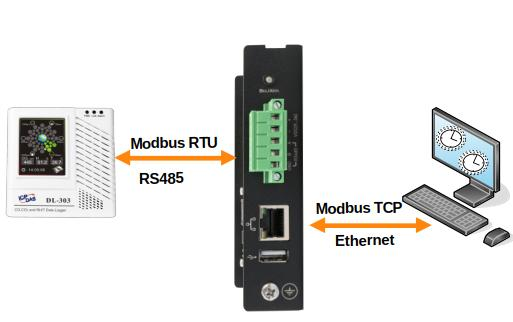

## Самое актуальное

> :fire: **Новый одноплатный компьютер [NAPI2](/docs/napi2/) на основе RK3568** \
> :fire: **Новый ПАК:** **[FCU3308PZ](/docs/special/FCU3308PZ/)** (**Система сбора данных в сетях ZigBee на NAPI-C**)  \
> :fire: Все устройства работают на **[NapiLinux 0.2.6.1](https://napilinux.ru/)** ( Российская ОС Linux для встраиваемых систем)  \
> **[Все новости](/blog/archive)**

>:point_up: **Telegram [канал](https://t.me/napiworld) по продуктам  @napiworld** \
>:point_up: **Telegram [канал](https://t.me/napilab) технический  @napilab** \
>:point_up: **E-mail: napi@nnz.ru** \
> :boom: **[Заявка на тестирование продуктов NAPI](/forms/napiorder/)**:boom:

:::tip  Придумано и произведено в России !

***Наши продукты активно используются в основе промышленных контроллеров, Modbus-шлюзов, IoT-шлюзов, RoIP-шлюзов. Промышленные ПК используются для сбора данных, в метрологии, в системах видеонаблюдения и тепловидения. Одним мы хороши там, где важны компактность, низкое энергопотребление и интеграция.***

:::

> При поддержке **[ООО "Коминтех"](https://comintech.pro/)** и **[ООО "Ниеншанц-Автоматика"](http://nnz-ipc.ru)**
## Одноплатные компьютеры

Готовые к работе одноплатники под управлением Linux

| Изображение | Продукт | CPU | ОЗУ | ПЗУ | Сеть | Особенности |
|-------------|---------|-----------|-----|-----|----------|-------------|
|  | **[NAPI2](/docs/napi2/) Новинка!** | RK3568J | 4 Гб | 32 Гб eMMC | 2×1 Гбит | :fire:Промышленный диапазон. Интерфейсы LVDS, HDMI, CAN, 2×GPIO 2.0мм. 9x109.5мм |
|  | **[NAPI-C NAPI-P](/docs/napi-intro/)** | RK3308 | 512 Мб | 4 Гб NAND | 1×100 Мбит | :fire:В реестре Минпромторг. Холодный процессор, компактный размер 43×43 мм. 2xGPIO 2.54мм|

## Процессорные модули

>Модули для Ваших и наших плат

| Изображение | Продукт | CPU | ОЗУ | ПЗУ | Сеть | Особенности |
|-------------|---------|-----------|-----|-----|----------|-------------|
|  | **[NAPI Slot](/docs/napi-som-intro/)** | RK3308 | 512 Мб | 32 Гб eMMC | 1×100 Мбит | :fire:Супер-компактный 30х26.8 мм. Модуль в формате PCI-E, совместим с Napi-C.

## Промышленные компьютеры

>Все промышленные компьютеры оптимизированы для крепления на DIN-рейку

| Изображение | Продукт | Модуль | ОЗУ | ПЗУ | Ethernet | Особенности |
|-------------|---------|-----------|-----|-----|----------|-------------|
|  | **[FCC3308](/docs/computers-industrial/FCC3308/)** | NAPI-C | 512 Мб | 4 Гб NAND | 1×100 Мбит |:fire:Супер-компактный .118×55мм, мало потребляет, встроенный RS485. Идеален для шлюзов.|
|  | **[FCU3308P](/docs/computers-industrial/FCU3308P/)** | NAPI-C | 512 Мб | 4 Гб NAND | 1x100Мбит 1х10Мбит | Слот для модулей связи (LTE,Zigbee, Lora), RS485, встроенный переменного датчик тока (опция).  |
|  | **[FCUCM4](/docs/computers-industrial/FCUCM4/)** | Orange PI CM4 | 2-8 Гб | 32-128 Гб eMMC | 1xГбит 1x100Мбит | Мощный ARM,  Слот для модулей связи (LTE,Zigbee, Lora). Хорош для сбора данных, координатора Zigbee. Доступный по цене. |
|  | **[FCU3568](/docs/computers-industrial/FCU3568/)** |[NAPI2](../../docs/napi2/) | 4 Гб | 32Гб eMMC | 2xГбит | Мощный ARM, промышленный диапазон, RS485, CAN,  слот для модулей связи (LTE,Zigbee, Lora). Хорош для сбора данных, координатора Zigbee, LTE шлюза. В процессе подачи в Минпромторг. |
<!--
|  | **[FCUCM4](/docs/computers-industrial/FCUCM4/)** | Orange PI CM4 | 2-8 Гб | 32-128 Гб eMMC | 1xГбит 1x100Мбит | Мощный ARM,  Слот для модулей связи (LTE,Zigbee, Lora). Хорош для сбора данных, координатора Zigbee. Доступный по цене. |
-->

## Готовые решения (Программно-аппаратные комплексы)

>Промышленные компьютеры с настроенным программным обеспечением под конкретную задачу

| Изображение | Продукт | На основе | Особенности |
|-------------|---------|-----------|-------------|
|  | **[FGM0801](/docs/special/frontgate-m/)** | FCC3308 | **Шлюз Modbus RTU ↔ Modbus TCP с памятью.** Настраивается через Веб-интерфейс NapiConfig. Умеет не только конвертировать данные, но и хранить локально с визуализацией данных|
|  | **[FGS0801](/docs/special/frontgate-s/)** | FCC3308 | **Шлюз SNMP V2 → V3** |
|  | **[FCU3308PG](/docs/special/FCU3308PG/)** | FCU3308P, FCUCM4 | **Токосборщик 2.0**. Измерение хранение и передача параметров однофазной сети переменного тока. Поддерживает LTE\Zigbee\Lora модули|
|  | **[FCU3308PZ](/docs/special/FCU3308PZ/)** | FCU3308P | Система передачи Modbus → ZigBee |

## Отладочные и учебные платы

>Для отладки ПО и прототипирования

| Изображение | Продукт | Модуль | ОЗУ | ПЗУ | Ethernet | Особенности |
|-------------|---------|-----------|-----|-----|----------|-------------|
|  | **[Napi Sci 2.0](/docs/sci/napisci/)** | Napi-C | 512 Мб | 4 Гб NAND | 1×100 Мбит | Учебная плата. Модульные датчики I2C датчики, дисплей, Реле, GPIO breadboard |

<!--
## Выбор по применению

### Для разработки и прототипирования
- **NAPI-C** - готов к работе сразу из коробки
- **NAPI2** - мощный вариант для требовательных задач

### Для промышленного применения
- **FCC3308** - компактный промышленный компьютер
- **FCU3308P** - с датчиком тока и модулями связи
- **FCUCM4** - мощная платформа на ARM64

### Готовые решения под ключ
- **FGM0801** - шлюз Modbus с веб-интерфейсом
- **FCU3308PG** - контроль энергопотребления
- **FCU3308PZ** - беспроводная передача данных ZigBee

-->

## Несущие платы и модули

>Каталог плат и модулей для решений NAPI

- **[Платы на основе NAPI-C](/docs/boards/napi-c-boards/)**
- **[Платы под OrangePi CM4](/docs/boards/napi-cm4/)**
- **[Платы для Napi-Slot](/docs/boards/napi-slot/)**
- **[Модули связи](/docs/boards/modules/)**

## Ваш продукт на основе NAPI

:::tip Сделаем Ваш продукт на NAPI

Сделаем несущую плату на основе NAPI под Ваш проект (датчики, сенсоры, модули сбора, АЦП, модули передачи данных).

:::
