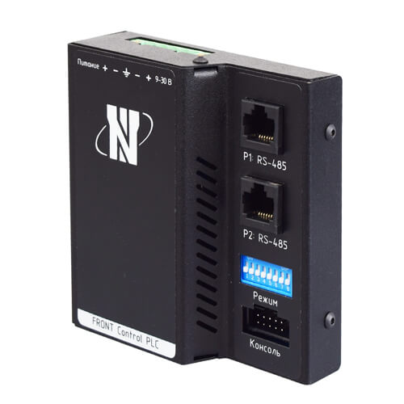

## Одноплатник NAPI и устройствах на SOM NAPI

Процессорный модуль на основе мощного ARM процессора Rockchip RK3308. Имеет 512Мб ОЗУ и 4Гб NAND Flash, 1хEthernet, 2xUSB? слот для SD-карты. 

[Документация]

:boom: Мы делаем не рендеринги, а живые устройства

:::tip

Мы рекомендуем и поддерживаем ОС [NapiLinux](http://www.napilinux.ru) как основную ОС для всех изделий на основе модуля NAPI

:::

## Платы и устройства на основе NAPI

SOM NAPI работает как самостоятельное устройство, но в практическом плане это устройство, которое вставляется в так называемые "несущие платы", которые осуществляют питание, дополнительные устройства, датчики, модемы и любые другие устройства по требованию вашего проекта. Вы найдете всю информацию для создания своих устройств на основе NAPI. 

## Семейство плат для NAPI

:::tip FrontControl Collector NG

Мы подготовили компактную универсальную и функциональную плату  FrontControl Collector NG для процессора NAPI, на основе которой можно в самые сжатые сроки сделать целое семейство устройств.

:::

**FrontControl Collector NG (Cборщик-компакт)**- недорогое универсальное устройство для сбора данных с датчиков. Позволяет хранить, анализировать данные прямо на устройстве, а также осуществляет передачу данных через различные сети. 

## Функциональные устройства на основе FrontControl Collector NG

:boom: Промышленный LTE-шлюз (сборщик-компакт + LTE modem)

:boom: Промышленный LORA-шлюз (сборщик-компакт + LORA modem)

:boom: Промышленный модуль LORA-базовая станция (сборщик-компакт + LORA БС модуль)

:boom: Промышленный модуль Modbus-шлюз (сборщик-компакт без модулей)

##  FrontControl NAPI Current Collector (Токо-сборщик). Пример монолитного функционального устройства.

«Токо-сборщик» - дешевая и практичная система сбора данных параметров однофазной сети (все в одном устройстве). 

## FRONT Control PLC ПЛК НЕМО

ПЛК НЕМО предназначен для создания систем автоматизированного управления технологическим оборудованием в энергетике, на ж/д транспорте, в различных областях промышленности, жилищно-коммунального и сельского хозяйства. Логика работы ПЛК определяется потребителем в процессе программирования контроллера. 

