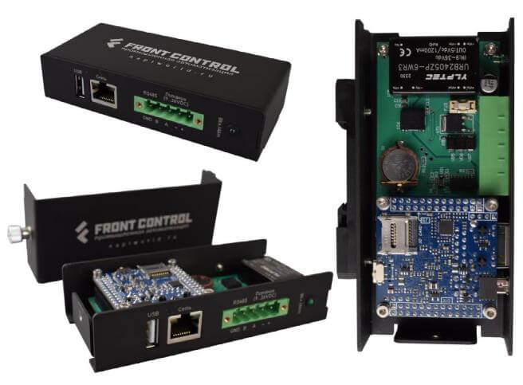

# NapiWorld - платы и решения на основе модуля NAPI

## Одноплатные вычислительные модули NAPI и устройствах на SOM NAPI

- :boom: **[Документация](/docs/napi-intro)**:boom:
- :boom: **[Взять на тестирование](../../docs/demokits/getontest-demokit2)**:boom:

Процессорный модуль на основе мощного ARM процессора Rockchip RK3308 под управлением ОС Linux (Armbain\NapiLinux). Имеет 512Мб ОЗУ и 4Гб NAND Flash, 1хEthernet, 2xUSB, слот для SD-карты, SPI, i2C, 3хUART.

**[Подробнее...](/docs/napi-intro)**

## Каталог готовых решений на основе NAPI

Мы создаем ряд закунченных изделий для сектора промышленной атвоматизации на основе модуля [NAPI](../../docs/napi-intro).

### Одноплатный компьютер "Сборщик-компакт" (FrontControl Compact).

Суперкомпактный одноплатный компьютер на основе модуля [NAPI C](../../docs/napi-intro) под управлением ОС Linux с изолирированными портами RS485, RTC, питанием 9-36DC или Passive POE. Корпус оптимизирован для крепления на DIN-рейку. 

- :boom: **[Документация](/docs/computers/frontcontrol-compact/)** :boom:
- :boom: **[Взять на тестирование](../../docs/demokits/getontest-demokit1)**:boom:

**[Подробнее...](/docs/computers/frontcontrol-compact/)**

### Токо-сборщик (FrontControl Current Collector)

«Токо-сборщик» - дешевая и практичная система сбора данных параметров однофазной сети с автономным хранением данных.

:boom: **[Документация](/docs/special/frontcurrent/)**:boom:

**[Подробнее...](/docs/special/frontcurrent/)**

### Мини-компьютер FRONT Control 150.901.

Миниатюрный компьютер для сбора и обработки данных FRONT Control 150.901

:::tip Посмотреть в каталоге Ниеншанц-Автоматика

Ссылка на продуктовый каталог: https://nnz-ipc.ru/catalogue/front_man/front_control/front_control_pc/

:::

## Ваш продукт на основе NAPI

:::tip Сделайте свой продукт на NAPI

Вы можете взять у нас проект несущей платы ["Сборщик-демокит](../../docs/hidden/frontcontrol-demo) и в сжатые сроки сделать свой продукт на основе NAPI.

:::

:::tip Сделаем Ваш продукт на NAPI

Сделаем несущую плату на основе NAPI под Ваш проект (датчики, сенсоры, модули сбора, АЦП, модули передачи данных).

:::