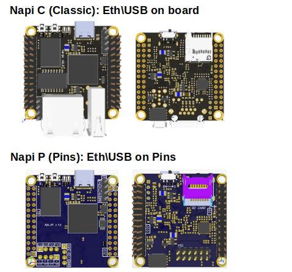

# NapiWorld - платы и решения на основе модуля NAPI

## Одноплатник NAPI и устройствах на SOM NAPI

:boom: **[Документация на процессорный модуль NAPI](/docs/napi-intro)**:boom:

Процессорный модуль на основе мощного ARM процессора Rockchip RK3308. Имеет 512Мб ОЗУ и 4Гб NAND Flash, 1хEthernet, 2xUSB, слот для SD-карты. 

## Преимущества подхода NAPI

:::tip Мы делаем не рендеринги, а живые устройства ! 

 Для начала работы с SOM NAPI не нужны дополнительные платы - можно работать с NAPI как с обычным одноплатником.

 

:::

:::tip Делайте свои решения на NAPI

SOM NAPI работает как самостоятельное устройство, но в практическом плане это устройство, которое вставляется в так называемые "несущие платы", которые осуществляют питание, дополнительные устройства, датчики, модемы и любые другие устройства по требованию вашего проекта. Вы найдете всю информацию для создания своих устройств на основе NAPI. 

:::

## Каталог продуктов

### Одноплатный компьютер "Сборщик-компакт" (FrontControl Compact).

Компактный мощный промышленный мини-компьютер

:boom: **[Документация на Сборщик-компакт](/docs/computers/frontcontrol-compact/)** :boom:

### Токо-сборщик (FrontControl Current Collector)

«Токо-сборщик» - дешевая и практичная система сбора данных параметров однофазной сети с автономным хранением данных.

:boom: **[Документация на Токо-Сборщик](/docs/special/frontcurrent/)**:boom:

### Мини-компьютер FRONT Control 150.901.

Миниатюрный компьютер для сбора и обработки данных FRONT Control 150.901

:::tip Посмотреть в каталоге Ниеншанц-Автоматика

Ссылка на продуктовый каталог: https://nnz-ipc.ru/catalogue/front_man/front_control/front_control_pc/

:::

## Ваш готовый продукт

:::tip Сделайте свой продукт на NAPI

Вы можете взять у нас проект несущей платформы FrontControl Compact и в сжатые сроки сделать свой продукт на основе NAPI.

:::

:::tip Сделаем Ваш продукт на NAPI

Мы можем сделать Ваш продукт на основе NAPI по техническому заданию. Сделаем несущую плату под Ваш проект (датчики, сенсоры, модули сбора, АЦП, модули передачи данных).

:::