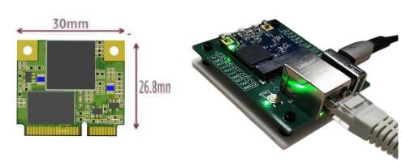
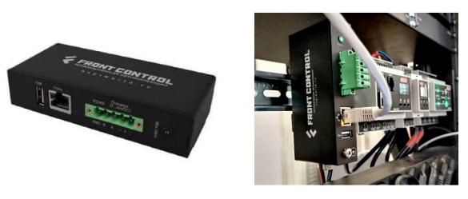

## Самое актуальное

> :fire: **Новый одноплатный компьютер [NAPI2](/docs/napi2/) на основе RK3568** \
> :fire: **Новый ПАК:** **[FCU3308PZ](/docs/special/FCU3308PZ/)**( **Система сбора данных в сетях ZigBee на NAPI-C**)  \
> :fire: Новый продукт: **[FCU3308P](/docs/computers-industrial/FCU3308P/)**( Сборщик-Универсал на NAPI-C)  \
> :fire: Новый продукт: **[FCUCM4](/docs/computers-industrial/FCUCM4/)** (Сборщик-Универсал на CM4) \
> :fire: Новый ПАК Токосборщик 2.0: **[FCU3308PG](/docs/special/FCU3308PG/)**( Сборщик-Универсал на NAPI-C)  \
> :fire: Все устройства работают на **[NapiLinux 0.2.6.1](https://napilinux.ru/)** ( Российская ОС Linux для встраиваемых систем)  \
> **[Все новости](/blog/archive)** \
> :boom: **[Заявка на тестирование продуктов NAPI](/anketa)**:boom:

>:point_up: **Telegram [канал](https://t.me/napiworld) по продуктам  @napiworld** \
>:point_up: **Telegram [канал](https://t.me/napilab) технический  @napilab**

:::tip Только Российские продукты !

***Все что вы видите на этом сайте придумано и разработано в России. Выбирая наши продукты, вы развиваете национальную электронику. Если вы проектируете банкоматы, контроллеры, системы сбора данных, зарядные станции — применение одноплатников NAPI сильно поможет попаданию вашего изделия в реестр Минпромторга!***

:::

## Одноплатные компьютеры

| Изображение | Продукт | Процессор | ОЗУ | ПЗУ | Ethernet | Особенности |
|-------------|---------|-----------|-----|-----|----------|-------------|
|  | **[NAPI2](/docs/napi2/)** | RK3568J | 4 Гб | 32 Гб eMMC | 2×1 Гбит | :fire: Новинка! LVDS, HDMI, 2×GPIO 2.0мм |
|  | **[NAPI-C NAPI-P](/docs/napi-intro/)** | RK3308 | 512 Мб | 4 Гб NAND | 1×100 Мбит | Разъемы на модуле, 43×43 мм |
|  | **[NAPI Slot](/docs/napi-som-intro/)** | RK3308 | 512 Мб | 32 Гб eMMC | 1×100 Мбит | PCI-E слот формат, супер-компактный |

## Промышленные компьютеры

| Изображение | Продукт | Процессор | ОЗУ | ПЗУ | Ethernet | Особенности |
|-------------|---------|-----------|-----|-----|----------|-------------|
|  | **[FCC3308](/docs/computers-industrial/FCC3308/)** | NAPI-C | 512 Мб | 4 Гб NAND | 1×100 Мбит | DIN-крепление, 118×55мм, RS485, PoE |
|  | **[FCU3308P](/docs/computers-industrial/FCU3308P/)** | NAPI-C | 512 Мб | 4 Гб NAND | 2×Ethernet | Датчик тока, PCI-E слот, консоль USB-C |
|  | **[FCUCM4](/docs/computers-industrial/FCUCM4/)** | Orange PI CM4 | 2-8 Гб | 32-128 Гб eMMC | 2×1 Гбит | Мощный ARM, датчик тока, PCI-E слот |

## Готовые решения (Программно-аппаратные комплексы)

| Изображение | Продукт | Процессор | ОЗУ | ПЗУ | Ethernet | Особенности |
|-------------|---------|-----------|-----|-----|----------|-------------|
|  | **[FGM0801](/docs/special/frontgate-m/)** | NAPI-C | 512 Мб | 4 Гб NAND | 1×100 Мбит | Шлюз Modbus RTU ↔ TCP с памятью |
|  | **[FGS0801](/docs/special/frontgate-s/)** | NAPI-C | 512 Мб | 4 Гб NAND | 1×100 Мбит | Шлюз SNMP V2 → V3 |
|  | **[FCU3308PG](/docs/special/FCU3308PG/)** | NAPI-C | 512 Мб | 4 Гб NAND | 2×Ethernet | Токосборщик 2.0, измерение электропараметров |
|  | **[FCU3308PZ](/docs/special/FCU3308PZ/)** | NAPI-C | 512 Мб | 4 Гб NAND | 2×Ethernet | Система передачи Modbus → ZigBee |

<!--
## Выбор по применению

### Для разработки и прототипирования
- **NAPI-C** - готов к работе сразу из коробки
- **NAPI2** - мощный вариант для требовательных задач

### Для промышленного применения
- **FCC3308** - компактный промышленный компьютер
- **FCU3308P** - с датчиком тока и модулями связи
- **FCUCM4** - мощная платформа на ARM64

### Готовые решения под ключ
- **FGM0801** - шлюз Modbus с веб-интерфейсом
- **FCU3308PG** - контроль энергопотребления
- **FCU3308PZ** - беспроводная передача данных ZigBee

-->

## Ваш продукт на основе NAPI

:::tip Сделаем Ваш продукт на NAPI

Сделаем несущую плату на основе NAPI под Ваш проект (датчики, сенсоры, модули сбора, АЦП, модули передачи данных).

:::
