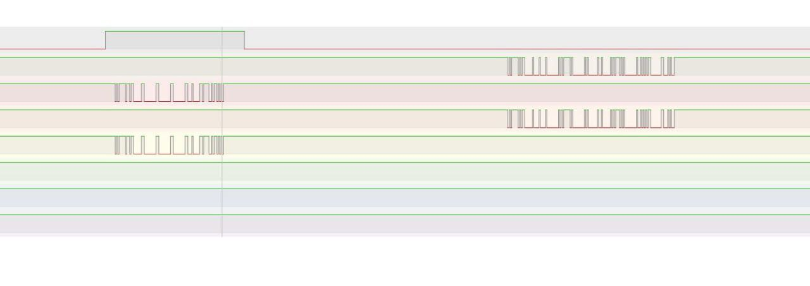

## Анализ сигналов Modbus RS485

Покажем передачу modbus пакетов, отображенную на анализаторе цифровых сигналов.

### Оборудование

- **Хост:** Napi-C с программным RTS
- **Датчик:** учебный Modbus Napi-датчик

### Конфигурация каналов

- **Канал 1:** RTS хоста
- **Канал 2:** RX хоста
- **Канал 3:** TX хоста
- **Канал 4:** RX датчика
- **Канал 5:** TX датчика

### Последовательность обмена

1. Хост поднимает сигнал **RTS** (передача)
2. Посылает запрос по линии **TX**
3. Датчик принимает запрос через **RX**
4. Датчик передает ответ через **TX**
5. Хост принимает ответ через **RX**

#rs485 #rts
