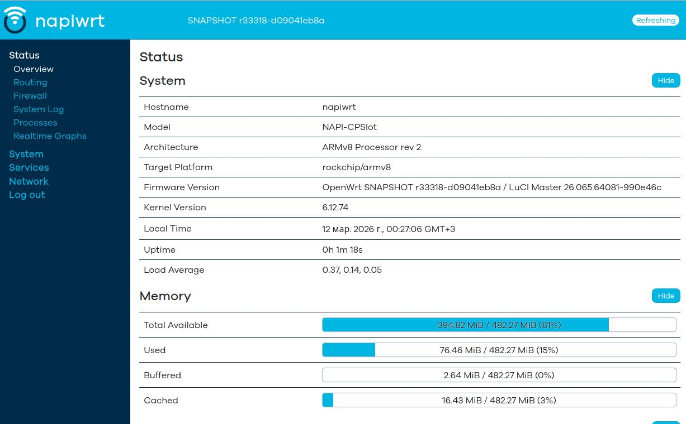
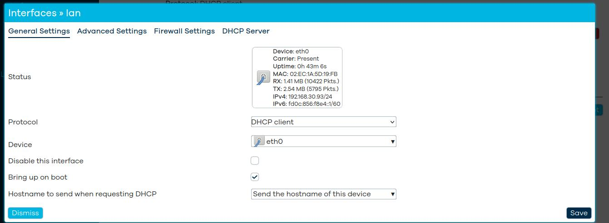
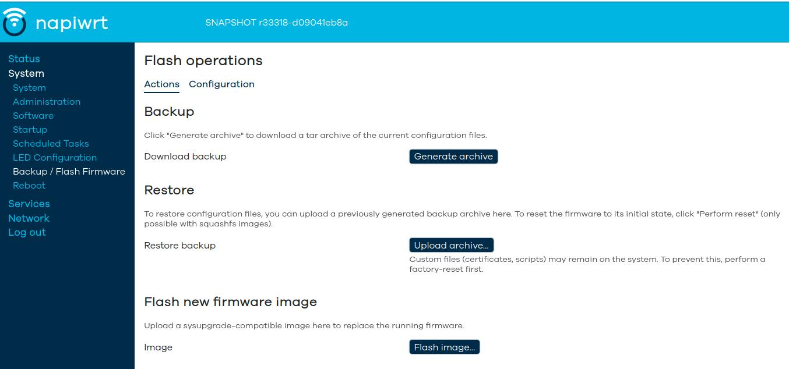
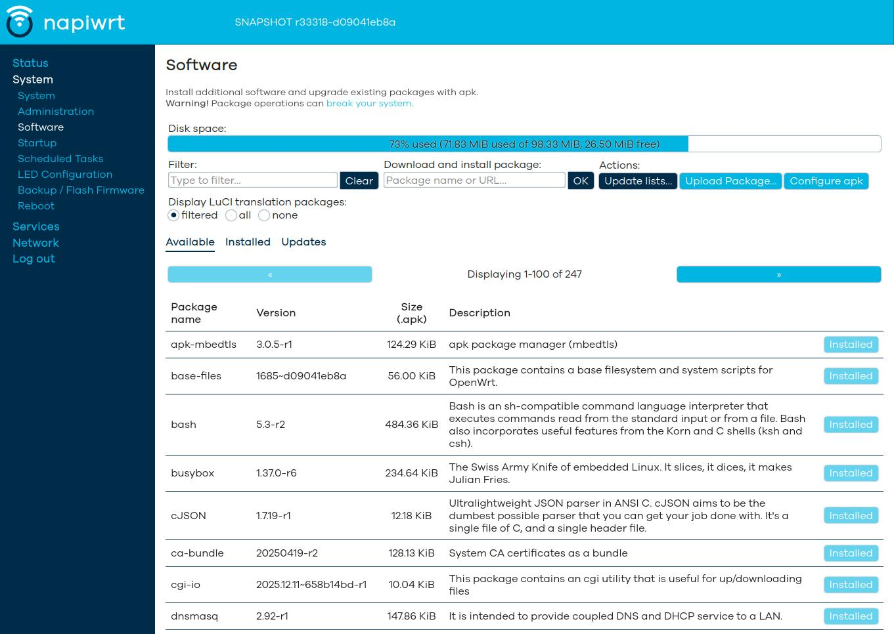
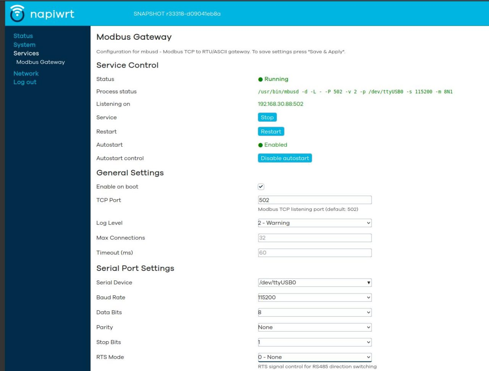

# Сборка OpenWrt для NapiLab Napi (RK3308): полный технический разбор

> Статья для тех, кто хочет собрать OpenWrt под платы NapiLab Napi самостоятельно и понимать, что именно происходит на каждом шаге — от патча U-Boot до первого входа по SSH.

---

## Зачем вообще собирать OpenWrt для Napi?

NapiLab Napi — промышленный одноплатный компьютер (SBC) и системный модуль (SOM) на базе Rockchip RK3308. Платформа ориентирована на промышленный IoT: сбор данных с датчиков, шлюзы Modbus TCP/RTU, MQTT-брокеры, удалённый мониторинг.

Ванильный OpenWrt доступен для "родственной" платы RockPi-S, но  не знает особенностей Napi: нет device tree дополнительных портов, нет правильной конфигурации U-Boot, нет пакетов для промышленного применения. [Наш репозиторий](https://github.com/lab240/napi-openwrt-build) — это набор патчей, DTS, uci-defaults и пакетов, которые превращают чистый снапшот OpenWrt в готовый промышленный одноплатник.

Если хотите сразу попробовать без сборки — готовые образы доступны на [странице загрузок napiworld.ru](https://napiworld.ru/downloads#napi-pcslot---openwrt).

### Что даёт кастомная сборка

- **Стабильный MAC-адрес** — генерируется из OTP-данных чипа, не меняется после перезагрузки
- **Правильный Device Tree** — UART1 и UART2 в нужных режимах, Bluetooth отключён
- **Готовый стек Modbus TCP** — `mbusd` + веб-интерфейс `luci-app-mbusd` из коробки
- **MQTT-брокер** — `mosquitto` уже установлен и настроен
- **Поддержка LTE-модемов** — Quectel EP06 работает без дополнительных танцев
- **Первый старт без консоли** — все настройки применяются через `uci-defaults` автоматически

---

## Поддерживаемое железо

Все платы используют один и тот же SoC — Rockchip RK3308, поэтому собирается одна прошивка для всей линейки:

| Плата | Хранилище | Тип |
|---|---|---|
| NapiLab Napi-C | 4 ГБ NAND — 32 ГБ eMMC | Промышленный SBC |
| NapiLab Napi-P | 4 ГБ NAND — 32 ГБ eMMC | Промышленный SBC |
| NapiLab Napi-Slot | 4 ГБ NAND — 32 ГБ eMMC | SOM |
| Radxa ROCK Pi S | — | Референсная плата, тот же RK3308 |

### Характеристики RK3308

| Компонент | Детали |
|---|---|
| CPU | Quad-core ARM Cortex-A35, 1.3 ГГц |
| RAM | 256 МБ / 512 МБ DDR3 |
| Ethernet | 100 Мбит/с (GMAC + PHY RTL8201F) |
| USB | 2× USB 2.0 Host |
| UART | 3× UART (ttyS0 — консоль, ttyS1, ttyS2) |
| Wi-Fi | RTL8723DS (802.11b/g/n) |

---

## Структура репозитория: что куда кладётся

```
openwrt-napi/
├── target/linux/rockchip/
│   ├── armv8/
│   │   └── base-files/          # Файлы первого старта (uci-defaults)
│   └── files/
│       └── arch/arm64/boot/dts/rockchip/
│           └── rk3308-napi-c.dts  # Кастомный Device Tree
│
├── package/boot/uboot-rockchip/
│   └── patches/
│       └── 0001-napic-rk3308-defconfig.patch  # Патч конфигурации U-Boot
│
├── package/luci-app-mbusd/      # Веб-интерфейс для mbusd
│
└── .config                      # Конфигурация сборки OpenWrt
```

Разберём каждую часть подробно.

---

## U-Boot: почему нужен патч и что он делает

OpenWrt собирает U-Boot из исходников вместе с прошивкой. Для RK3308 есть готовая конфигурация для Radxa ROCK Pi S — мы взяли её за основу, так как схемотехника близка к Napi.

### Патч `0001-napic-rk3308-defconfig.patch`

Патч добавляет новый вариант `napic-rk3308` в систему сборки U-Boot:

```patch
+++ b/configs/napic-rk3308_defconfig
@@ -0,0 +1,42 @@
+CONFIG_ARM=y
+CONFIG_ARCH_ROCKCHIP=y
+CONFIG_SYS_TEXT_BASE=0x00600000
+CONFIG_ROCKCHIP_RK3308=y
+CONFIG_TARGET_EVB_RK3308=y
+CONFIG_DEFAULT_DEVICE_TREE="rk3308-napi-c"
+CONFIG_DISTRO_DEFAULTS=y
+CONFIG_SYS_MALLOC_F_LEN=0x4000
+CONFIG_BAUDRATE=1500000
+CONFIG_BOOTDELAY=0
...
```

Ключевые настройки:
- `CONFIG_DEFAULT_DEVICE_TREE="rk3308-napi-c"` — указываем U-Boot использовать наш DTS
- `CONFIG_BAUDRATE=1500000` — нестандартная скорость консоли (1.5 Мбод), типичная для Rockchip
- `CONFIG_BOOTDELAY=0` — не ждём прерывания при старте (промышленное применение)

### Как собрать только U-Boot

```bash
make package/boot/uboot-rockchip/compile VARIANT=napic-rk3308 -j$(nproc)
```

Флаг `VARIANT=napic-rk3308` говорит системе сборки использовать именно наш `defconfig`.

---

## Device Tree (DTS): описываем железо ядру

Device Tree — это описание аппаратной конфигурации платы в текстовом формате. Ядро Linux не знает про периферию «само по себе», ему нужно явно сказать: «вот тут UART, вот тут Ethernet, вот GPIO».

### Файл `rk3308-napi-c.dts`

Берём за основу `rk3308-rock-pi-s.dts` (Radxa ROCK Pi S — ближайший аналог по схемотехнике) и переопределяем то, что отличается у Napi.

```dts
/dts-v1/;
#include "rk3308.dtsi"
#include "rk3308-rock-pi-s.dtsi"

/ {
    model = "NapiLab Napi-C";
    compatible = "napilab,napi-c", "rockchip,rk3308";
};

/* UART1 → RS-485 через mbusd */
&uart1 {
    status = "okay";
    pinctrl-names = "default";
    pinctrl-0 = <&uart1_xfer>;
};

/* UART2 — доступен как /dev/ttyS2 */
&uart2 {
    status = "okay";
};

/* Bluetooth отключаем — не нужен в промышленном применении */
&bluetooth {
    status = "disabled";
};
```

Что важно в этом DTS:

**`uart1`** — маппится на `/dev/ttyS1`. Это главный последовательный порт, к которому подключаются RS-485 устройства Modbus. `mbusd` будет слушать именно его.

**`uart2`** — маппится на `/dev/ttyS2`, доступен для дополнительных устройств.

**`bluetooth disabled`** — RTL8723DS предоставляет и Wi-Fi, и Bluetooth через один чип. Bluetooth нам не нужен и только занимает UART, поэтому отключаем на уровне DTS — никаких лишних сервисов, никаких потерь производительности.

### Где лежит DTS в дереве OpenWrt

```
target/linux/rockchip/files/arch/arm64/boot/dts/rockchip/rk3308-napi-c.dts
```

OpenWrt копирует файлы из `target/linux/<arch>/files/` поверх исходников ядра перед компиляцией. Это стандартный механизм добавления новых DTS без форка ядра.

---

## uci-defaults: автоматическая настройка при первом старте

`uci-defaults` — это скрипты, которые OpenWrt запускает **один раз** при первой загрузке и затем удаляет. Они позволяют настроить систему до того, как пользователь зашёл в веб-интерфейс или по SSH.

Скрипты лежат в:
```
target/linux/rockchip/armv8/base-files/etc/uci-defaults/
```

Нумерация определяет порядок выполнения. Разберём каждый:

---

### `91-bash` — bash как оболочка по умолчанию

```sh
#!/bin/sh
# Меняем /bin/ash на /bin/bash для root
sed -i 's|/bin/ash|/bin/bash|' /etc/passwd
```

По умолчанию OpenWrt использует `ash` (BusyBox). Для работы с промышленными скриптами, которые рассчитаны на bash-синтаксис (массивы, `[[`, `$RANDOM`, process substitution), нужен настоящий bash. Скрипт делает одно изменение в `/etc/passwd`.

---

### `92-timezone` — московское время

```sh
#!/bin/sh
uci set system.@system[0].timezone='MSK-3'
uci set system.@system[0].zonename='Europe/Moscow'
uci commit system
```

Промышленные устройства работают в конкретном часовом поясе. Временна́я метка в логах и данных должна быть правильной сразу, без ручной настройки. MSK-3 — это UTC+3 (Москва).

---

### `93-console-password` — пароль на серийную консоль

```sh
#!/bin/sh
# Включаем запрос пароля на ttyS0
uci set system.@system[0].ttylogin='1'
uci commit system
```

По умолчанию OpenWrt пускает на консоль без пароля — удобно при разработке, неприемлемо в продакшне. Скрипт включает запрос пароля на `ttyS0` (консоль 1.5 Мбод).

---

### `94-macaddr` — стабильный MAC из OTP

Это самый важный скрипт. Проблема: у RK3308 нет встроенного уникального MAC-адреса в eFuse — он генерируется случайно при каждой загрузке. Это катастрофа для промышленного применения: DHCP-сервер каждый раз выдаёт другой IP, ARP-таблицы засоряются, устройство теряется в сети.

Решение: генерировать MAC детерминированно из OTP (One-Time Programmable) памяти чипа. OTP содержит уникальные данные, которые прошиваются на заводе и никогда не меняются.

```sh
#!/bin/sh

# Читаем OTP и берём MD5 от него
MAC=$(cat /sys/bus/nvmem/devices/rockchip-otp0/nvmem | md5sum | \
  sed 's/\(..\)\(..\)\(..\)\(..\)\(..\)\(..\).*/02:\1:\2:\3:\4:\5/')

# Применяем MAC к интерфейсу
uci set network.@device[0].macaddr="$MAC"
uci commit network
```

Разбор команды по частям:

1. `/sys/bus/nvmem/devices/rockchip-otp0/nvmem` — бинарный файл с содержимым OTP через интерфейс `nvmem` ядра
2. `md5sum` — хешируем бинарные данные, получаем 32 hex-символа
3. `sed` — берём первые 12 символов и форматируем как MAC
4. Первый байт `02` — бит Local (bit 1 = 1) установлен, бит Multicast (bit 0 = 0) сброшен. Это стандарт для locally-administered MAC

Результат: каждая плата Napi получает один и тот же MAC при каждой загрузке, но разные платы имеют разные MAC — уникальность гарантирована уникальностью OTP.

---

### `95-network` — настройка Ethernet без бриджа

```sh
#!/bin/sh

# Убираем дефолтный бридж br-lan
uci set network.lan.device='eth0'
uci set network.lan.type=''
uci delete network.@bridge-vlan[0] 2>/dev/null

uci commit network
```

Стандартный OpenWrt создаёт бридж `br-lan` из всех Ethernet-портов — это логично для роутера с несколькими портами. У Napi один Ethernet-порт, бридж избыточен. Скрипт переводит `lan` напрямую на `eth0`, убирая лишний сетевой уровень.

---

### `96-hostname` — имя устройства

```sh
#!/bin/sh
uci set system.@system[0].hostname='napiwrt'
uci commit system
```

`napiwrt` — имя по умолчанию. Устройство будет видно в сети как `napiwrt.local` (через mDNS). Пользователь может сменить имя через LuCI.

---

### `97-luci-theme` — тема веб-интерфейса

```sh
#!/bin/sh
uci set luci.main.mediaurlbase='/luci-static/openwrt-2020'
uci commit luci
```

Тема `openwrt-2020` — современный Bootstrap-based интерфейс. Тема `bootstrap` (старая) выглядит устаревшей. Устанавливаем сразу нужную.

---

### `99-dhcp` — конфигурация DHCP

```sh
#!/bin/sh

# Убираем dnsmasq с lan-интерфейса — устройство само получает IP по DHCP
uci set dhcp.lan.ignore='1'
uci commit dhcp
```

Napi в типовой конфигурации — не роутер, а промышленный шлюз. Он не должен раздавать DHCP в сеть, он должен получать IP сам. Скрипт отключает DHCP-сервер на `lan`.

---

## Пакеты: что и зачем включено в сборку

### Промышленный стек

| Пакет | Назначение |
|---|---|
| `mbusd` | Шлюз Modbus RTU → Modbus TCP. Слушает `/dev/ttyS1` (RS-485) и пробрасывает на TCP-порт |
| `luci-app-mbusd` | Веб-интерфейс для `mbusd`: старт/стоп, конфигурация порта, мониторинг |
| `mbpoll` | CLI-инструмент для опроса Modbus-устройств с командной строки |
| `mosquitto` | MQTT-брокер. Устройства публикуют данные в топики, приложения подписываются |
| `mosquitto-client` | CLI-клиент: `mosquitto_pub` и `mosquitto_sub` для отладки |

### Поддержка USB-Serial адаптеров

```
kmod-usb-serial-ch341   # WCH CH340/CH341 (самые распространённые)
kmod-usb-serial-cp210x  # Silicon Labs CP2102 и серия
kmod-usb-serial-ftdi    # FTDI FT232 и совместимые
kmod-usb-serial-pl2303  # Prolific PL2303
```

Napi имеет 2× USB 2.0. Через USB-Serial можно подключить дополнительные RS-485/RS-232 адаптеры или устройства с USB-интерфейсом.

### Поддержка LTE

```
kmod-usb-net-qmi-wwan   # QMI-протокол для LTE-модемов
uqmi                     # Пользовательский инструмент для управления QMI
```

Поддержка Quectel EP06 (Cat-6 LTE). Модем подключается через USB, управляется через QMI. `uqmi` позволяет настроить APN, поднять PPP-соединение, смотреть сигнал.

### Сетевые инструменты

```
openssh-sftp-server   # SFTP — копирование файлов через SSH без FTP
luci-ssl-wolfssl      # HTTPS для LuCI (wolfSSL — лёгкая альтернатива OpenSSL)
tcpdump               # Захват трафика прямо на устройстве
ethtool               # Диагностика Ethernet
```

### Административные утилиты

```
bash    # Полноценная оболочка
htop    # Мониторинг процессов
nano    # Редактор для тех, кто не любит vi
screen  # Мультиплексор терминала — незаменим при работе через последовательный порт
```

---

## luci-app-mbusd: веб-интерфейс для Modbus-шлюза

Пакет `luci-app-mbusd` — наша собственная разработка. `mbusd` — отличный Modbus-шлюз, но управляется только через конфиг-файл и командную строку. Для промышленного применения нужен удобный веб-интерфейс.

### Что умеет luci-app-mbusd

- Запуск / остановка / перезапуск службы `mbusd` через кнопки в браузере
- Включение / отключение автозапуска при загрузке
- Live-статус процесса с отображением реальных параметров запуска
- Отображение IP-адреса и порта, на котором слушает шлюз
- Полная конфигурация: последовательный порт, скорость, чётность, стоп-биты, параметры Modbus

Интерфейс написан как стандартное LuCI-приложение на Lua + HTML, следует конвенциям OpenWrt UCl API.

---

## Сборка: пошаговая инструкция

### 1. Зависимости (Ubuntu/Debian)

```bash
sudo apt install build-essential clang flex bison g++ gawk gcc-multilib \
  gettext git libncurses-dev libssl-dev python3-distutils rsync unzip zlib1g-dev
```

### 2. Клонируем OpenWrt

```bash
git clone https://github.com/openwrt/openwrt.git
cd openwrt

# Обновляем фиды (репозитории пакетов)
./scripts/feeds update -a
./scripts/feeds install -a
```

### 3. Накладываем кастомизации

Архив с кастомизациями берём из [релизов репозитория](https://github.com/lab240/napi-openwrt-build/releases):

```bash
# Распаковываем наш архив поверх дерева OpenWrt
tar xzf napic-openwrt-YYYYMMDD-HHMM-v1.0.tar.gz -C /path/to/openwrt/
```

Архив содержит все файлы из нашего репозитория в том же дереве каталогов, что и OpenWrt. После распаковки:
- `target/linux/rockchip/` — дополнен нашим DTS и uci-defaults
- `package/boot/uboot-rockchip/patches/` — содержит патч U-Boot
- `package/luci-app-mbusd/` — добавлен наш пакет
- `.config` — готовая конфигурация сборки

### 4. Собираем U-Boot

```bash
make package/boot/uboot-rockchip/compile VARIANT=napic-rk3308 -j$(nproc)
```

U-Boot для Rockchip RK3308 состоит из нескольких стадий:
- **TPL** (Tertiary Program Loader) — инициализация DDR
- **SPL** (Secondary Program Loader) — инициализация минимального железа
- **U-Boot proper** — полноценный загрузчик

Все три стадии собираются автоматически, результат упаковывается в `idbloader.img` + `u-boot.itb`.

### 5. Собираем прошивку

```bash
make -j$(nproc)
```

Система сборки OpenWrt:
1. Компилирует кросс-тулчейн (gcc, binutils, musl libc)
2. Компилирует ядро Linux с нашим DTS
3. Компилирует все выбранные пакеты
4. Упаковывает rootfs + ядро + U-Boot в финальный образ

Время сборки на современном железе (8 ядер): 30–60 минут при первой сборке, 5–10 минут при пересборке с изменениями.

### 6. Результат сборки

```
bin/targets/rockchip/armv8/
└── openwrt-rockchip-armv8-napilab_napic-ext4-sysupgrade.img.gz
```

Образ содержит таблицу разделов GPT, U-Boot, ядро, rootfs — всё в одном файле.

---

## Прошивка

Если не хотите собирать самостоятельно — готовые образы доступны на [странице загрузок napiworld.ru](https://napiworld.ru/downloads#napi-pcslot---openwrt).

```bash
# Распаковываем
gunzip openwrt-rockchip-armv8-napilab_napic-ext4-sysupgrade.img.gz

# Пишем на носитель (замените /dev/sdX на реальное устройство!)
dd if=openwrt-rockchip-armv8-napilab_napic-ext4-sysupgrade.img \
   of=/dev/sdX \
   bs=4M \
   status=progress
sync
```

> ⚠️ Внимательно проверьте `/dev/sdX` командой `lsblk` перед записью. Ошибка в имени устройства приведёт к затиранию данных.

---

## Первый запуск

После записи образа и подачи питания:

1. **U-Boot** стартует, инициализирует DDR, находит ядро в разделе
2. **Ядро** загружается, парсит наш DTS, инициализирует периферию
3. **OpenWrt init** запускает скрипты `uci-defaults` (один раз)
4. Устройство получает IP по DHCP (MAC стабилен — DHCP-сервер выдаст тот же IP)
5. LuCI доступен по `http://<IP>/`

### Параметры доступа по умолчанию

| Параметр | Значение |
|---|---|
| IP | DHCP (стабильный MAC гарантирует постоянный lease) |
| Веб-интерфейс | `http://<IP>/` → LuCI |
| SSH | `root@<IP>` (пароль не установлен, задаётся при первом входе) |
| Консоль | `ttyS0`, 1 500 000 бод |

---

## Типичные вопросы

**Почему скорость консоли 1.5 Мбод?**

Это стандарт Rockchip для отладочных UART. На такой скорости загрузочные сообщения U-Boot и ядра отображаются без задержек. Требуется адаптер USB-UART с поддержкой нестандартных скоростей (CP2102, FTDI — работают, CH340 — часто нет).

**Почему за основу взяли ROCK Pi S, а не официальный RK3308 EVB?**

ROCK Pi S — хорошо поддерживаемая в апстриме OpenWrt плата на RK3308. Её конфигурация U-Boot и DTS проверены сообществом, регулярно обновляются. EVB (Evaluation Board от Rockchip) в OpenWrt поддерживается хуже.

**Можно ли добавить свои пакеты?**

Да. Добавьте пакеты в `.config` (через `make menuconfig` или напрямую) и пересоберите. Кастомный пакет можно положить в `package/` или добавить внешний фид.

**Как обновить прошивку через LuCI?**

System → Backup / Flash Firmware → Flash new firmware image. Загрузите `sysupgrade.img.gz`. OpenWrt сохранит пользовательские настройки (`/etc/config/`) если не снять галочку «Keep settings».

---

##  Скриншоты

1.

Командная строка через консоль, ssh

2.

Главная страница

3.

Настройка сети


4.

Обновление, бекап, рестор

5.

Пакеты

6.

Mbusd
